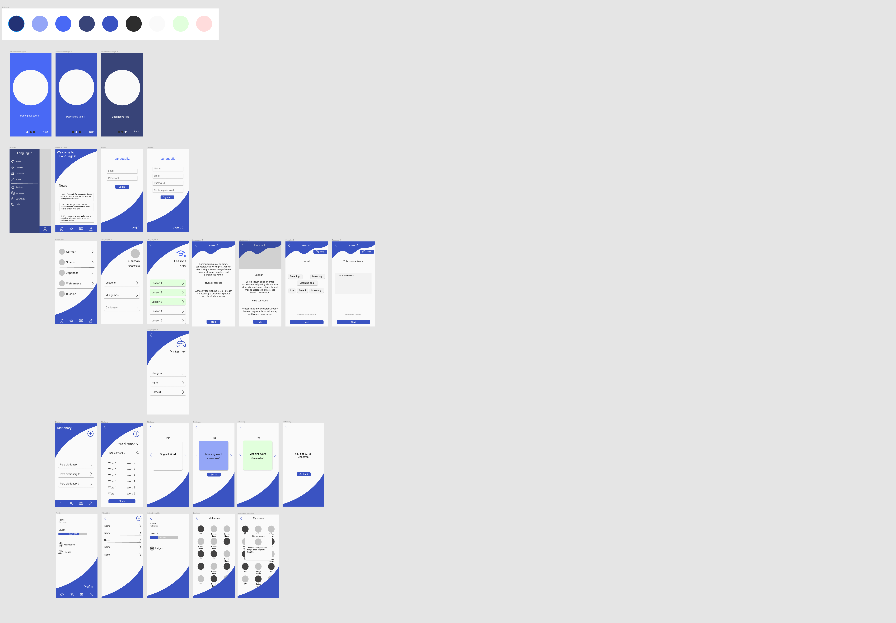

# LanguagEz
La aplicación LanguagEz tiene como objetivo ayudar a los usuarios a aprender idiomas con lecciones variadas bien estructuradas y minijuegos para reforzar el conocimiento de forma entretenida.

## Descripción
Los usuarios tendrán acceso a varias funcionalidades, la primera siendo la más importante serán las lecciones las cuales en lugar de seguir una plantilla establecida serán hechas dependiendo de como sea lo mejor para ellas. Además de eso contarán con minijuegos como el ahorcado o las parejas para reforzar su conocimiento. A eso se le añadirá acceso a un diccionario del lenguaje con las palabras usadas en las lecciones, las cuales podrán estudiar por lecciones; o puede que prefieran usar el diccionario personal, en el que podrán crear sus propias colecciones de palabras y estudiarlas.

## ¿Qué se usara?
Para el desarrollo del proyecto se usarán varias tecnologías:
- Flutter para la  aplicación de android.
- Laravel para la API de la aplicación.
- MySQL para la base de datos.
- Ionic para un dashboard accesible solo a administradores.

## ¿Cuáles son los contenidos de la web de Ionic?
En la web de Ionic los administradores podrán hacer varias cosas, las más importantes siendo:
- Creación de noticias que serán mostradas en la página de Inicio de la app.
- Gestión de usuarios
- Creación de lecciones
- HomePage 

## ¿Cuáles son los contenidos de la app?
La aplicación contará con las siguientes funcionalidades:
- Lecciones de distintos idiomas.
- Minijuegos para practicar más los idiomas.
- Lista de amigos
- Sistema de medallas
- Diccionario de idiomas
- Diccionario personal
- Exportar e importar diccionarios personales (?)
- Buscador en el diccionario (tanto por la palabra en el idioma original como el significado)
- Un sistema de niveles
- Un tablón de noticias

## Diseño App

## Diseño Ionic

